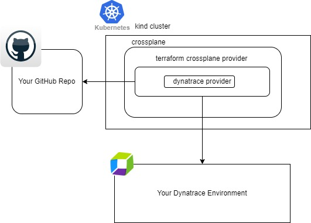

# Observability Lab: Using Crossplane to Automate Dynatrace Configuration as Code on Kubernetes

Dynatrace has long been compatible with [configuration as code](https://docs.dynatrace.com/docs/manage/configuration-as-code) using both [Monaco](https://docs.dynatrace.com/docs/manage/configuration-as-code/monaco) and [Terraform](https://docs.dynatrace.com/docs/manage/configuration-as-code/terraform).

Both Monaco and Terraform need to be triggered so usually this is handled by a pipeline, CRON Job or another regularly executing task.

Crossplane provides a way to have a 24/7 automated reconciliation loop without needing to trigger Monaco or Terraform on demand.

## Quick overview of Crossplane

[Crossplane](https://www.crossplane.io/) is a CNCF project which can bring true automated GitOps workflows to managing Dynatrace configuration.

Crossplane itself, of course, doesn't know how to talk to infrastructure providers like AWS or Dynatrace. So you need to install a Crossplane Provider.

These providers contain the "know how" to communicate with individual backends (like AWS) or in this case, Terraform.

This tutorial uses Crossplane with the [Terraform provider](https://marketplace.upbound.io/providers/upbound/provider-terraform/v0.18.0).
The tutorial also specifies [the Dynatrace terraform provider](https://registry.terraform.io/providers/dynatrace-oss/dynatrace/latest) which "knows" how speak to Dynatrace.

> So, crossplane has a Terraform provider and the Terraform provider in turn has a Dynatrace provider.

Crossplane will be configured to watch a repository (your fork of this repository) for new Terraform configurations which it will then automatically apply to your Dynatrace environment.

## Fork this repository

You will be making changes to the code in this repo. So begin by forking this repo to your own account.

Make all changes in your fork.

## [Start the hands-on here >>](https://dynatrace.github.io/obslab-crossplane)

