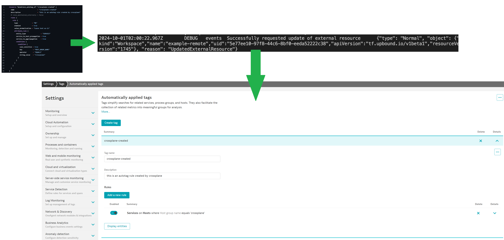

# obslab-crossplane

> :warning: This is a work in progress



Dynatrace has long been compatible with [configuration as code](https://docs.dynatrace.com/docs/manage/configuration-as-code) using both [Monaco](https://docs.dynatrace.com/docs/manage/configuration-as-code/monaco) and [Terraform](https://docs.dynatrace.com/docs/manage/configuration-as-code/terraform).

Both Monaco and Terraform need to be triggered so usually this is handled by a pipeline, CRON Job or another regularly executing task.

Crossplane provides a way to have a 24/7 automated reconciliation loop without needing to trigger Monaco or Terraform on demand.

## Quick overview of Crossplane

[Crossplane](https://www.crossplane.io/) is a CNCF project which can bring true automated GitOps workflows to managing Dynatrace configuration.

Crossplane itself, of course, doesn't know how to talk to infrastructure providers like AWS or Dynatrace. So you need to install a Crossplane Provider.

These providers contain the "know how" to communicate with individual backends (like AWS) or in this case, Terraform.

This tutorial uses Crossplane with the [Terraform provider](https://marketplace.upbound.io/providers/upbound/provider-terraform/v0.18.0).
The tutorial also specifies [the Dynatrace terraform provider](https://registry.terraform.io/providers/dynatrace-oss/dynatrace/latest) which "knows" how speak to Dynatrace.

> So, crossplane has a Terraform provider and the Terraform provider in turn has a Dynatrace provider.

Crossplane will be configured to watch a repository (your fork of this repository) for new Terraform configurations which it will then automatically apply to your Dynatrace environment.


## Fork this repository

You will be making changes to the code in this repo. So begin by forking this repo to your own account.

Make all changes in your fork.

## Create Cluster

Download and add [kind](https://kind.sigs.k8s.io) to your `PATH`.

Then create a cluster.

```
kind create cluster
```

## Create Crossplane Namespace

```
kubectl create namespace crossplane-system
```

## Create DT Secret

1. Generate a Dynatrace access token (for the configuration in this demo you only
   need `settings.read` and `settings.write` but your token permissions will vary
   if you add different types of config).

   See [here](https://registry.terraform.io/providers/dynatrace-oss/dynatrace/latest/docs) for more info.


Create a secret that the Terraform Provider for crossplane
will use to connect to Dynatrace

```
kubectl -n crossplane-system create secret generic dt-details \
  --from-literal=DYNATRACE_ENV_URL=https://abc12345.live.dynatrace.com \
  --from-literal=DYNATRACE_API_TOKEN=dt0c01.sample.secret
```

## Install Crossplane on Cluster
```
# Install Crossplane
helm repo add crossplane-stable https://charts.crossplane.io/stable
helm repo update
helm install crossplane --namespace crossplane-system --wait crossplane-stable/crossplane --values crossplane-values.yaml
```

## Install and Configure Terraform provider

```
kubectl apply -f terraform-config.yaml
```

Wait for the Terraform provider pod to be `Ready`:

```
kubectl -n crossplane-system wait pod --for condition=Ready -l pkg.crossplane.io/provider=provider-terraform
```

## Configure Terraform Provider

Configure the Terraform provider to know all about Dynatrace.

```
kubectl apply -f terraform-provider-config.yaml
```

## Point Crossplane to your Fork

* ✔️ Crossplane is installed
* ✔️ Terraform is installed
* ✔️ Terraform knows how to "talk to" Dynatrace
* ⛔ Terraform doesn't know where the configuration as code is stored


Tell Terraform where the configuration as code (eg. auto tag rules) reside.
This is done via a `Workspace` custom resource.

Modify `workspace-remote.yaml` and change `dynatrace/obslab-crossplane` to the details of your fork.

For example, if your account was `SomeUser` and the repo was called `obslab-crossplane` then line 8 would look like this:

``
    module: git::https://github.com/SomeUser/obslab-crossplane?ref=main
``

Apply that file:

```
kubectl apply -f workspace-remote.yaml
```

🎊 Crossplane and terraform are now monitoring the `config_as_code` directory of your Git repo for changes and will auto-sync any updates.


## View Created Settings

In dynatrace:

* Press `ctrl + k`. Search for `settings`
* Go to `Settings > Tags > Automatically applied tags`

After about 1 minute you should see a new tag called `crossplane-created`.

Look at [config_as_code/main.tf](https://github.com/Dynatrace/obslab-crossplane/blob/main/config_as_code/main.tf) for the definition of this tag rule.

> Tip: You can add new `.tf` files inside this folder. Terraform will automatically pick up any `.tf` files inside the folder.
>
> Exercise: Try creating a new tag called `crossplane-created-2`

## TODO List

* Observing crossplane - this tutorial or a new one?


